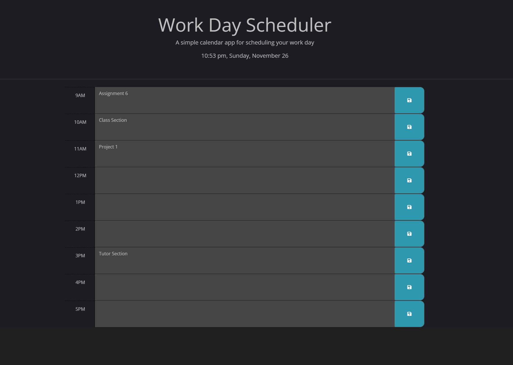

# Work Day Scheduler

The Work Day Scheduler application was created to have 9am to 5pm hourly sections which can be populated with tasks that have individualized save buttons. These will store the data of their respective task to local storage and that will be retrieved upon page re-visit.

The present time and date is displayed in the header. The rows of hours will dynamically change their appearence (background-color) based on comparison with present day's hour.

## Features

- user-frindly layout
- current time displayed via Day.js api
- hour based task list from 9am to 5pm; work-day
- colors of the hour-rows change; whether the hour is past, present, or future in comparison with present hour of day.
- save button on each hour-row to save its respective task-entry.
- local storage used to store the all tasks under a single tag, then retrieved on page refresh to populate the hour-rows.

## Appendix

https://developer.mozilla.org/en-US/

https://developer.mozilla.org/en-US/docs/Web/API

https://day.js.org/docs/en/display/format

https://api.jquery.com/category/selectors/

## Authors

- [Syed Kazmi](https://github.com/kazmiali123)

## Deployment

Website URL: https://kazmiali123.github.io/Challange5-DailyCalander/

GitHub Repository: https://github.com/kazmiali123/Challange5-DailyCalander

## Demo

Work Day Scheduler Demo Image

